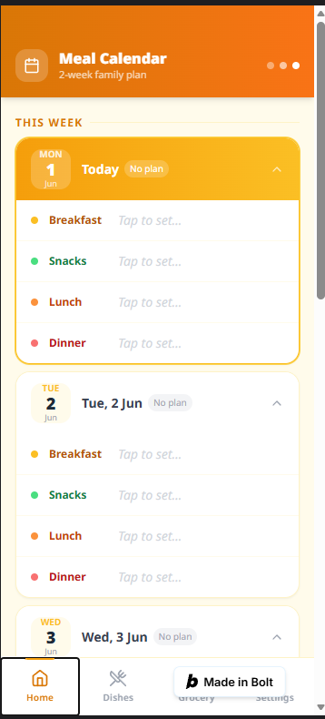
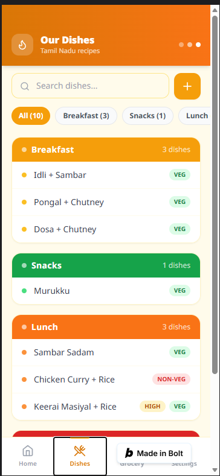
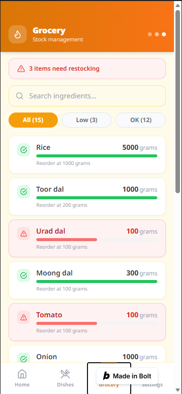

# 🍛 TN Meal Planner

> A Tamil Nadu family meal planning PWA — plan traditional South Indian meals for 2 weeks, manage grocery stock, and override meals on the fly.

[](LICENSE)
[](https://react.dev/)
[](https://www.typescriptlang.org/)
[](https://tailwindcss.com/)
[](https://vitejs.dev/)
[](https://web.dev/progressive-web-apps/)

---

## 📸 Screenshots

| Home — 2-Week Plan | Dishes Library | Grocery Stock |
|---|---|---|
|  |  |  |

> Screenshots coming soon. Run locally to see the app in action.

---

## ✨ Features

- **2-Week Meal Calendar** — view and manage Breakfast, Snacks, Lunch & Dinner for the next 14 days
- **Meal Override** — tap any meal to swap it with a custom dish
- **Tamil Nadu Dish Library** — browse dishes by meal type (Breakfast / Snacks / Lunch / Dinner), filter by Veg / Non-Veg and priority
- **Add New Dishes** — add dishes with meal type, frequency, priority, and ingredients
- **Grocery Stock Manager** — track ingredient quantities, reorder levels, and get low-stock alerts
- **One-tap Plan Generation** — trigger a fresh weekly plan via Google Sheets backend
- **PWA Ready** — installable on Android/iOS, works offline-first
- **Mobile-first UI** — optimised for 375px viewports with bottom navigation

---

## 🏗️ Tech Stack

| Layer | Technology |
|---|---|
| Frontend | React 18 + TypeScript |
| Styling | Tailwind CSS 3 |
| Build | Vite 5 |
| Icons | Lucide React |
| Backend | Google Apps Script (REST) |
| Data | Google Sheets |
| PWA | Web App Manifest |

---

## 🚀 Getting Started

### Prerequisites

- Node.js ≥ 18
- npm ≥ 8

### Installation

```bash
git clone https://github.com/YOUR_USERNAME/mealplanner.git
cd mealplanner
npm install
npm run dev
```

Open [http://localhost:5173](http://localhost:5173) in your browser.

### Build for Production

```bash
npm run build
npm run preview
```

---

## 🔌 Backend Setup (Google Sheets)

This app uses a Google Apps Script as its REST backend. The script reads/writes a Google Sheet that acts as the database.

### Sheet Structure

Your Google Sheet needs these tabs:

| Tab Name | Columns |
|---|---|
| `WeeklyPlan` | `date`, `Breakfast`, `Snacks`, `Lunch`, `Dinner` |
| `Dishes` | `Dish_Name`, `Meal_Type`, `Veg_NonVeg`, `Priority`, `Ingredients`, `Frequency` |
| `Grocery` | `Ingredient`, `Current_Qty`, `Reorder_Level`, `Unit` |

### Apps Script Actions

The script handles these `action` query params:

| Action | Method | Description |
|---|---|---|
| `getWeeklyPlan` | GET | Fetch 2-week meal plan |
| `getDishes` | GET | Fetch all dishes |
| `getGrocery` | GET | Fetch grocery inventory |
| `overrideMeal` | GET | Override a specific meal |
| `updateGrocery` | GET | Update ingredient quantity |
| `addDish` | GET | Add a new dish |
| `triggerPlan` | GET | Generate a fresh weekly plan |

### Connecting Your Sheet

Update the `BASE_URL` in [`src/api/index.ts`](src/api/index.ts) with your deployed Apps Script URL:

```ts
const BASE_URL = 'https://script.google.com/macros/s/YOUR_SCRIPT_ID/exec';
```

---

## 📁 Project Structure

```
src/
├── api/
│   └── index.ts          # All API calls to Google Apps Script
├── components/
│   ├── AddDishModal.tsx   # Modal to add a new dish
│   ├── BottomNav.tsx      # Bottom navigation bar
│   ├── GroceryUpdateModal.tsx  # Modal to update stock qty
│   ├── LoadingSpinner.tsx
│   └── MealOverrideModal.tsx   # Modal to override a meal
├── screens/
│   ├── HomeScreen.tsx     # 2-week calendar view
│   ├── DishesScreen.tsx   # Dish library with search/filter
│   ├── GroceryScreen.tsx  # Grocery stock management
│   └── SettingsScreen.tsx # App info + plan trigger
├── types/
│   └── index.ts           # Shared TypeScript types
├── App.tsx
├── main.tsx
└── index.css
```

---

## 🤝 Contributing

Contributions are welcome! Please read [CONTRIBUTING.md](CONTRIBUTING.md) before submitting a PR.

1. Fork the repo
2. Create a feature branch: `git checkout -b feat/your-feature`
3. Commit your changes: `git commit -m 'feat: add your feature'`
4. Push to your branch: `git push origin feat/your-feature`
5. Open a Pull Request

---

## 📄 License

This project is licensed under the **MIT License** — see the [LICENSE](LICENSE) file for details.

---

## 🙏 Acknowledgements

- Built with [Bolt.new](https://bolt.new) — AI-powered full-stack development
- UI inspired by traditional Tamil Nadu cuisine and culture
- Icons by [Lucide](https://lucide.dev/)

---

<p align="center">Made with ❤️ for Tamil families everywhere</p>
